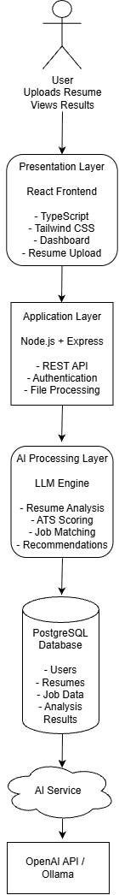

# System Architecture

## 1. Overview

The AI Career Assistant Platform follows a modern full-stack architecture designed to integrate frontend services, backend APIs, artificial intelligence processing, and data storage components.

The architecture focuses on scalability, maintainability, security, and efficient AI-powered career analysis.

# 2. Architecture Components

The system consists of four major layers:

1. Presentation Layer (Frontend)
2. Application Layer (Backend)
3. AI Processing Layer
4. Data Storage Layer

# 3. Presentation Layer (Frontend)

## Technology Stack

- React
- TypeScript
- Tailwind CSS

## Responsibilities

The frontend layer provides the user interface and handles user interactions.

Main responsibilities:

- User registration and login interface
- Resume upload interface
- Job description input
- Display AI analysis results
- Display ATS scores
- Display career recommendations
- Dashboard visualization

# 4. Application Layer (Backend)

## Technology Stack

- Node.js
- Express.js

## Responsibilities

The backend layer manages application logic and communication between frontend, AI services, and databases.

Main responsibilities:

- Handle API requests
- Manage user authentication
- Process uploaded resume files
- Communicate with AI services
- Manage business logic
- Store and retrieve application data

# 5. AI Processing Layer

## Technology Stack

- Large Language Models (LLMs)
- OpenAI API / Ollama

## Responsibilities

The AI processing layer provides intelligent analysis capabilities.

Main responsibilities:

- Resume content understanding
- Skill extraction
- Experience analysis
- ATS score generation
- Job matching
- Skill gap identification
- Career recommendations
- Interview question generation

# 6. Data Storage Layer

## Technology Stack

- PostgreSQL
- Supabase

## Responsibilities

The database layer stores and manages application data.

Stored information:

- User accounts
- Resume information
- Job descriptions
- Analysis results
- User history

# 7. Technology Stack

| Layer | Technology |
|---|---|
| Frontend | React, TypeScript, Tailwind CSS |
| Backend | Node.js, Express.js |
| Database | PostgreSQL, Supabase |
| AI Layer | LLM, OpenAI API, Ollama |
| File Processing | PDF Parser, DOCX Parser |
| Version Control | Git, GitHub |

# 8. System Data Flow

The overall system data flow:

1. User uploads a resume through the frontend.

2. Frontend sends resume data to backend APIs.

3. Backend validates and processes uploaded files.

4. Resume text is extracted from uploaded documents.

5. Extracted information is sent to the AI processing layer.

6. AI analyzes resume content and generates insights.

7. Analysis results are stored in the database.

8. Frontend retrieves and displays results to the user.

# 9. Architecture Diagram

# 10. Future Scalability

The architecture supports future improvements such as:

- Cloud-based AI services
- Multiple AI model integration
- Advanced recommendation engines
- Automated job searching
- Mobile application support