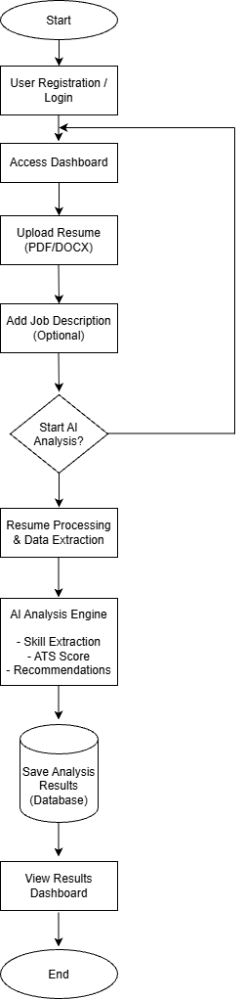
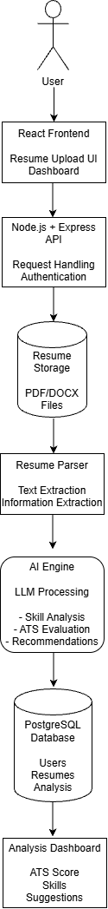

# User Flow

## Overview

This document describes how users interact with the AI Career Assistant Platform.


## New User Flow

1. User visits the platform.
2. User creates an account.
3. User logs into the system.
4. User accesses the dashboard.
5. User uploads a resume.
6. User provides a target job description.
7. User starts AI analysis.
8. AI processes the resume.
9. System generates analysis results.
10. User views recommendations.
11. User saves the analysis history.


## Resume Analysis Flow
```
    User Uploads Resume
            ↓
    System Validates File
            ↓
    Extract Text From Resume
            ↓
    Process Resume Content
            ↓
    Send Data To AI Model
            ↓
    Generate Analysis
            ↓
    Store Results
            ↓
    Display Results To User
```


## Job Matching Flow
```
    User Adds Job Description
            ↓
    System Extracts Job Requirements
            ↓
    Compare Resume Skills
            ↓
    Calculate Match Percentage
            ↓
    Identify Missing Skills
            ↓
    Generate Recommendations
            ↓
    Display Results
```


## Interview Preparation Flow
```
    User Requests Interview Questions
            ↓
    AI Generates Questions
            ↓
    User Provides Answers
            ↓
    AI Evaluates Answers
            ↓
    Provides Feedback
```

## User Roles

## Job Seeker

The main user of the system.

Responsibilities:

- Create an account
- Upload resumes
- Add job descriptions
- View AI analysis results
- Receive career recommendations
- Prepare for interviews


## AI System

The AI engine processes user data and provides intelligent recommendations.

Responsibilities:

- Extract resume information
- Analyze skills
- Generate ATS score
- Identify skill gaps
- Generate interview questions

## Diagrams

## Overall User Flow




## AI Processing Flow




## Future User Flow Improvements

Future versions may include:

- AI resume builder
- LinkedIn profile analysis
- Automated job recommendations
- AI mock interviews